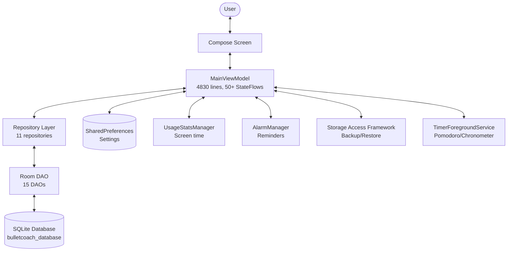
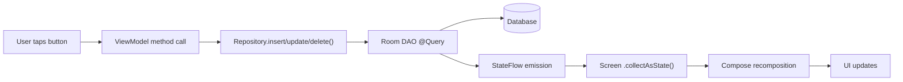
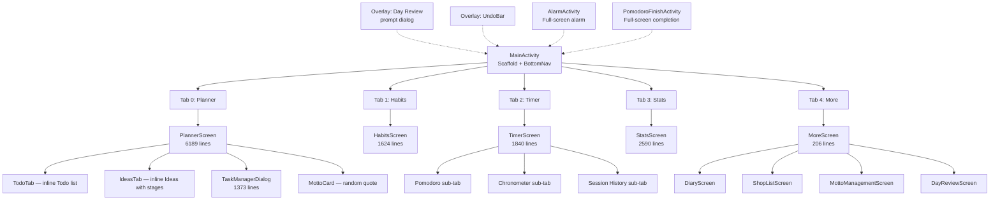
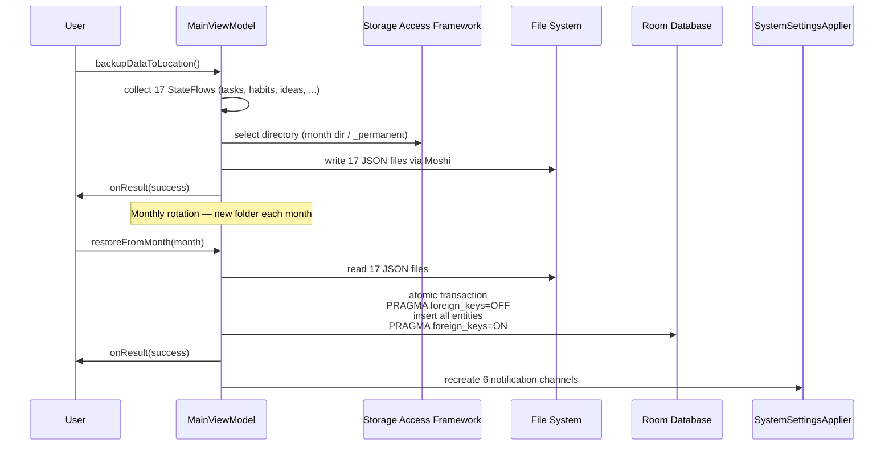
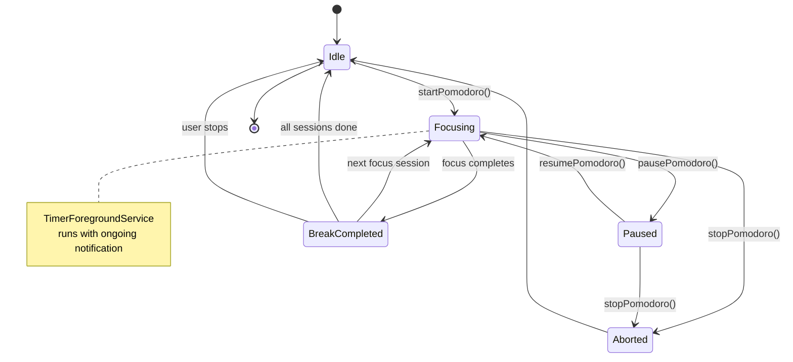
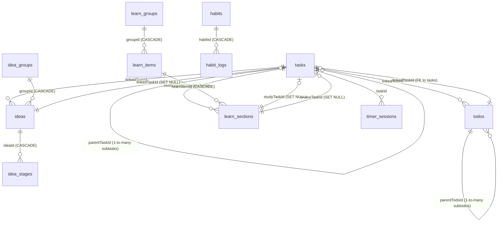

# MyPlanner — BulletCoach

> A minimal, private, offline-first planner, habit tracker, and life organizer for Android.

**No accounts, no cloud sync (except manual Drive backup), no ads, no data collection.**

---

## Features

| Category | Features |
|----------|----------|
| 📋 **Planner** | Daily/weekly/Monthly/Year views, task CRUD, drag-to-reorder, bullet journal (• task / o event / - note), labels, priorities, recurrence, subtasks, pomodoro linking |
| 🔄 **Ideas & Todos** | Grouped ideas with inline stage management; priority-based todos with two-way task linking (convert task↔idea, link task↔todo) |
| 🧠 **Learning** | Spaced repetition (Leitner: 1/3/7/16/35/90 day intervals), study/review task auto-generation, per-item scheduling |
| ⏱ **Pomodoro & Timer** | Configurable focus/break/long-break, templates, task-linked sessions, chronometer (stopwatch), session history with date filters |
| 📝 **Diary** | Markdown journal with 300ms auto-save, undo/redo, date navigation, calendar picker |
| 🛒 **Shopping List** | Items with quantity, price, notes; filter by All/To Buy/Purchased; strikethrough on purchase |
| 💬 **Mottos** | Inspirational quotes with author; random display on planner, full CRUD management |
| 🌙 **Day Review** | End-of-day reflection: 4 fields (Good/Bad/Improve/Gratitude), 5-star mood, 1-10 slider, auto-prompt at user-set time |
| 📊 **Statistics** | Task completion trends (done vs postponed ratio, daily activity line charts), habit chart, sleep log, pomodoro stats, screen time per app |
| 🔔 **Reminders** | Alarm-based event reminders (night-before + X minutes before), habit reminders, boot/time-change persistence, full-screen alarm activity |
| 💾 **Backup/Restore** | JSON export to user-selected Storage Access Framework (SAF) directory, monthly rotation, 17 entity types, Google Drive compatible |
| 🌐 **Persian Calendar** | Full Jalali date support: toggleable FA/EN across all date displays, month views, stats graphs |

---

## Architecture

### High-Level Flow



### Data Flow — Unidirectional



### Navigation Tree



### ViewModel StateFlow Architecture

```mermaid
flowchart TD
    VM[MainViewModel\n4830 lines] --> Nav["🌐 Navigation\ncurrentTab, selectedDate\nselectedMonth, usePersianCalendar"]
    VM --> Tasks["📋 Tasks\ndailyTasks, monthlyTasks\nallTasks, pendingReviewTask"]
    VM --> Habits["✅ Habits\nhabits, todayHabits\nhabitLogs, todayHabitLogs"]
    VM --> Ideas["💡 Ideas\nideaGroups, allIdeas"]
    VM --> Todos["📝 Todos\npendingTodos, allTodos"]
    VM --> Timer["⏱ Pomodoro\npomodoroSecondsLeft, pomodoroRunning\npomodoroPhase, pomodoroCompletionState"]
    VM --> Chrono["⏲ Chronometer\nchronoElapsed, chronoRunning"]
    VM --> Sessions["📊 Sessions\ntimerTemplates, allTimerSessions\nhistorySessions"]
    VM --> Sleep["😴 Sleep\nallSleepLogs, sleepLog"]
    VM --> Diary["📖 Diary\ndiaryDates, diaryEntryForDate()"]
    VM --> Shop["🛒 Shop\nunpurchasedItems, purchasedItems"]
    VM --> Mottos["💬 Mottos\ntodayMotto, allMottos"]
    VM --> Learn["🧠 Learning\nlearnItems, learnGroups\nsectionsForLearnItem()"]
    VM --> DayRev["🌙 Day Review\nreviewForDate()"]
    VM --> ScreenTime["📱 Screen Time\nappUsageItems, totalScreenTimeMinutes"]
    VM --> Settings["⚙️ Settings\n40+ preference StateFlows"]
    VM --> Undo["↩ Undo System\nundoStack with 11 snapshot types"]
```



### Backup/Restore Pipeline



### Undo System

```mermaid
stateDiagram-v2
    [*] --> Idle
    Idle --> SnapshotTaken: User performs action
    SnapshotTaken --> UndoBarVisible: pushUndo() called
    UndoBarVisible --> Restoring: User taps UNDO
    Restoring --> Idle: restoreFromUndo()<br/>re-inserts snapshot
    UndoBarVisible --> Expired: 5s timeout
    Expired --> Idle: clearExpiredUndos()
    UndoBarVisible --> Idle: User dismisses
    
    note right of SnapshotTaken: 11 snapshot types:<br/>Task, Todo, Idea, Habit, Diary<br/>DayReview, TimerTemplate<br/>TimerSession, ShopItem<br/>Motto, LearnItem
```

### Pomodoro Timer State Machine



---

## Tech Stack

| Layer | Technology | Version |
|-------|-----------|---------|
| **Language** | Kotlin | 2.2.10 |
| **UI** | Jetpack Compose + Material 3 | BOM 2024.09 |
| **Database** | Room (SQLite) | 2.7.0 |
| **Architecture** | Single module, single ViewModel | — |
| **Build** | Gradle + AGP + KSP | 9.3.1 / 9.1.1 |
| **Serialization** | Moshi (codegen via KSP) | — |
| **Networking** | Retrofit + OkHttp | — |
| **Backup** | Storage Access Framework (SAF) | — |
| **Drive** | Google Play Services Auth + Drive API | — |
| **Background** | WorkManager | 2.7.1 |
| **Scheduling** | AlarmManager | — |
| **Testing** | JUnit + Robolectric + Roborazzi | — |
| **AI** | Firebase AI (Gemini) | — |

---

## Project Structure

```
app/src/main/java/com/example/
├── MainActivity.kt                          # Entry point, scaffold, bottom nav, permissions gate
│
├── core/
│   ├── database/
│   │   ├── AppDatabase.kt                   # Room DB (31 migrations, 17 entities, 15 DAOs)
│   │   ├── dao/                             # 15 DAO interfaces
│   │   └── entity/                          # 17 entity classes + 2 support files
│   │
│   ├── manager/
│   │   ├── BackupFileManager.kt             # SAF-based JSON backup: create dirs, read/write 17 files
│   │   ├── BackupWorker.kt                  # WorkManager CoroutineWorker for background backup
│   │   ├── ReminderManager.kt               # Alarm scheduling with PendingIntent → ReminderReceiver
│   │   └── SystemSettingsApplier.kt         # Post-restore notification channel recreation
│   │
│   ├── receiver/
│   │   └── ReminderReceiver.kt              # BroadcastReceiver: boot, time change, locale change
│   │
│   ├── repository/                          # 11 repository wrappers (DAO → Repository)
│   │
│   ├── service/
│   │   └── TimerForegroundService.kt        # Foreground service for pomodoro/chronometer
│   │
│   └── utils/
│       └── PersianCalendarHelper.kt         # Android ICU Persian calendar singleton
│
└── ui/
    ├── components/                          # 10 reusable composables
    │   ├── HeaderActions.kt                 # Home + Settings icon buttons
    │   ├── TaskManagerDialog.kt             # Full task CRUD dialog (1373 lines)
    │   ├── LineChart.kt                     # Canvas-based line chart
    │   ├── CalendarDatePicker.kt            # Persian/Western date picker
    │   ├── ActiveTimerWidget.kt             # Floating pomodoro widget
    │   ├── FastPomodoroSetupDialog.kt       # Quick pomodoro config
    │   ├── TimerSetupComponents.kt          # Timer template + time input
    │   ├── MottoCard.kt                     # Animated quote card
    │   ├── DayReviewCard.kt                 # Day review summary card
    │   └── UndoBar.kt                       # Animated undo with countdown
    │
    ├── screens/                             # 11 screen files (13 logical screens)
    │   ├── PlannerScreen.kt                 # Main planner (6189 lines) — includes TodoTab + IdeasTab inline
    │   ├── HabitsScreen.kt                  # Habit tracking with calendar
    │   ├── TimerScreen.kt                   # Pomodoro + Chronometer + History tabs
    │   ├── StatsScreen.kt                   # Statistics dashboard
    │   ├── MoreScreen.kt                    # 5th tab gateway (Diary, Shop, Mottos, Day Review)
    │   ├── DiaryScreen.kt                   # Markdown diary
    │   ├── ShopListScreen.kt               # Shopping list
    │   ├── MottoManagementScreen.kt         # Quote CRUD
    │   ├── DayReviewScreen.kt              # End-of-day reflection
    │   ├── PermissionsScreen.kt            # Runtime permissions gate
    │   ├── AlarmActivity.kt                # Full-screen alarm activity
    │   └── PomodoroFinishActivity.kt       # Full-screen timer completion
    │
    ├── theme/
    │   ├── Color.kt                         # "Goodtime Minimalist Dark" palette
    │   ├── Theme.kt                         # MyApplicationTheme (dark-first, no dynamic color)
    │   └── Type.kt                          # Material3 Typography
    │
    └── viewmodel/
        └── MainViewModel.kt                 # ALL state + CRUD + sync (4830 lines)
```

**Total: 76 Kotlin source files, ~27,500 lines of code.**

---

## Database Schema

### Entity Relationship Diagram



### Entity Summary

| # | Entity | Table | Size | Primary FK References |
|---|--------|-------|------|----------------------|
| 1 | `TaskEntity` | `tasks` | 32 columns | parentTaskId→tasks, linkedTodoId→todos, linkedIdeaId→ideas, linkedLearnSectionId→learn_sections |
| 2 | `TodoEntity` | `todos` | 14 columns | linkedTaskId→tasks, parentTodoId→todos |
| 3 | `IdeaEntity` | `ideas` | 11 columns | groupId→idea_groups (CASCADE), linkedTaskId→tasks (SET NULL) |
| 4 | `IdeaGroupEntity` | `idea_groups` | 6 columns | — |
| 5 | `IdeaStageEntity` | `idea_stages` | 9 columns | ideaId→ideas (CASCADE) |
| 6 | `HabitEntity` | `habits` | 16 columns | — |
| 7 | `HabitLogEntity` | `habit_logs` | 8 columns | habitId→habits (CASCADE) |
| 8 | `TimerSessionEntity` | `timer_sessions` | 11 columns | taskId→tasks (SET NULL) |
| 9 | `TimerTemplateEntity` | `timer_templates` | 8 columns | — |
| 10 | `SleepLogEntity` | `sleep_logs` | 10 columns | — |
| 11 | `DiaryEntryEntity` | `diary_entries` | 7 columns | — |
| 12 | `ShopItemEntity` | `shop_items` | 9 columns | — |
| 13 | `MottoEntity` | `mottos` | 6 columns | — |
| 14 | `DayReviewEntity` | `day_reviews` | 12 columns | — |
| 15 | `LearnGroupEntity` | `learn_groups` | 6 columns | — |
| 16 | `LearnItemEntity` | `learn_items` | 17 columns | groupId→learn_groups (CASCADE) |
| 17 | `LearnSectionEntity` | `learn_sections` | 16 columns | learnItemId→learn_items (CASCADE), studyTaskId→tasks (SET NULL), reviewTaskId→tasks (SET NULL) |

### Migration History

| Migration | Version | Key Change |
|-----------|---------|------------|
| `MIGRATION_1_16` | 1 → 16 | Initial schema — 14 tables |
| `MIGRATION_16_17` | 16 → 17 | Add `postponed` column to tasks |
| `MIGRATION_17_18` | 17 → 18 | Create timer_sessions + timer_templates, migrate from pomodoro_sessions |
| `MIGRATION_18_23` | 18 → 23 | Recreate timer tables with updated schema |
| `MIGRATION_23_24` | 23 → 24 | Add `priorityLevel` to learn_items |
| `MIGRATION_24_25` | 24 → 25 | Create learn_groups table, add `groupId` to learn_items |
| `MIGRATION_25_26` | 25 → 26 | Add `sortOrder` to learn_items |
| `MIGRATION_26_27` | 26 → 27 | Add `scheduleMode` + `scheduleDaysOfWeek` to learn_items |
| `MIGRATION_27_28` | 27 → 28 | Create 6 indexes for learn tables |
| `MIGRATION_28_29` | 28 → 29 | Major FK refactor: tasks ↔ todos/ideas/sections/linked entities |
| `MIGRATION_29_30` | 29 → 30 | Add `updatedAt` + `isDeleted` to ALL 17 tables |
| `MIGRATION_30_31` | 30 → 31 | Add `postpone_count` to tasks, migrate `postponed=1` → `postpone_count=1` |

---

## Permissions

| Permission | Why It's Needed |
|------------|-----------------|
| `POST_NOTIFICATIONS` | Show reminder and pomodoro notifications (Android 13+) |
| `SCHEDULE_EXACT_ALARM` | Precise alarm timing for event/habit reminders |
| `PACKAGE_USAGE_STATS` | Screen time tracking per app (Stats screen) |
| `ACCESS_NOTIFICATION_POLICY` | Mute reminders during Do Not Disturb (DND toggle in settings) |
| `MANAGE_EXTERNAL_STORAGE` | Direct file access mode for backup/restore |
| `REQUEST_IGNORE_BATTERY_OPTIMIZATIONS` | Keep pomodoro timer alive in background |
| `RECEIVE_BOOT_COMPLETED` | Reschedule alarms after device restart |
| `FOREGROUND_SERVICE` | Run pomodoro/chronometer as foreground service |
| `USE_EXACT_ALARM` | Alternative precise alarm permission (Android 14+) |

All permissions are requested at runtime via `PermissionsScreen` which acts as a gate — the main app UI is only shown after all required permissions are granted.

---

## Build & Run

### Prerequisites

- Android Studio (latest stable)
- Android SDK 36
### Commands

```powershell
.\gradlew assembleDebug         # Build debug APK
.\gradlew testDebugUnitTest     # Run unit tests
```

> **Note:** For local builds, remove `signingConfig = signingConfigs.getByName("debugConfig")` from `app/build.gradle.kts` first.

### Debug Build

The `debugConfig` signing config uses a debug keystore. For a local run without signing, comment out the signing config line in `build.gradle.kts`.

---

## Design Decisions

- **No Jetpack Navigation** — Manual tab switching via `selectedTab: Int` with `AnimatedContent` transitions. Sub-screens in `MoreScreen` use a `sealed class MoreSubScreen` approach.
- **No DI Framework** — Manual dependency injection via `MainViewModelFactory` that receives all 11 repositories plus application context.
- **Single ViewModel** — All application state lives in one `MainViewModel` (4830 lines). State is exposed as typed `StateFlow` instances and collected via `.collectAsState()` in composables.
- **No Jetpack DataStore** — All preferences stored in SharedPreferences (accessed through the ViewModel).
- **Dark-First Theme** — "Goodtime Minimalist Dark" palette (`#080808` background, `#00E676` mint primary, `#FF7043` coral for breaks).
- **Persian Calendar** — Uses Android ICU library with `fa_IR@calendar=persian` locale for Jalali date conversion.
- **Spaced Repetition** — Leitner system with 6 intervals: 1, 3, 7, 16, 35, 90 days.

---

## Key Concepts

### Task ↔ Todo ↔ Idea Linking

Tasks can be linked to todos (two-way), ideas (convertible), and learn sections (study/review auto-generation). When a linked entity is deleted, the ViewModel handles cleanup:

- **Task deleted →** Unlink from todos, ideas, learn sections
- **Todo completed →** Optionally mark linked task complete
- **Idea converted →** Creates tasks for each stage

### Learning System

Each learn item has sections. Study tasks and review tasks are auto-generated in the planner. The Leitner algorithm schedules reviews at increasing intervals:
- After studying: review in 1 day → 3 days → 7 days → 16 days → 35 days → 90 days
- Scheduling respects per-item `scheduleMode` (daily, weekly, custom days)

### Backup Format

Backup is a directory of JSON files (one per entity type) written via Moshi. The `BulletCoachBackup` data class contains 17 typed lists. Files are organized by month in a user-selected SAF directory:

```
/BackupDir/
├── 2026-01/
│   ├── tasks.json
│   ├── habits.json
│   ├── todos.json
│   └── ... (17 files total)
├── 2026-02/
│   └── ...
├── _permanent/
│   └── ... (preferences, etc.)
```

---

## License

Private — All rights reserved.
